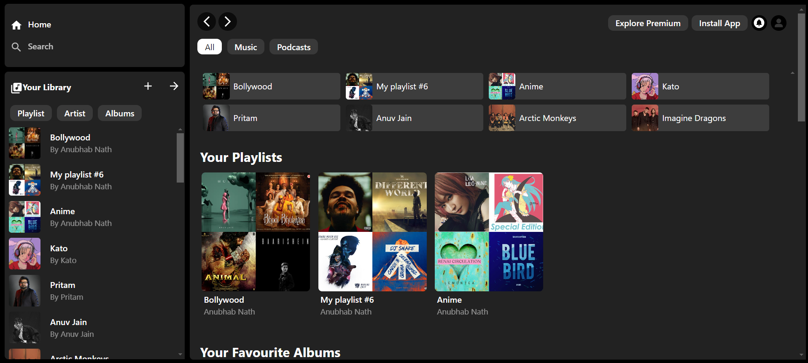
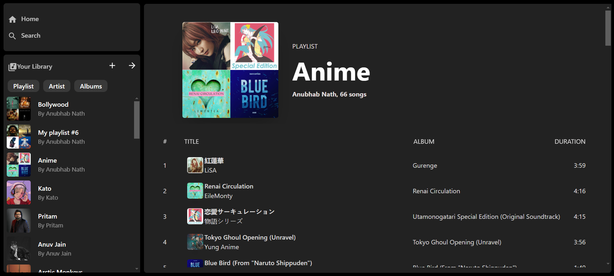
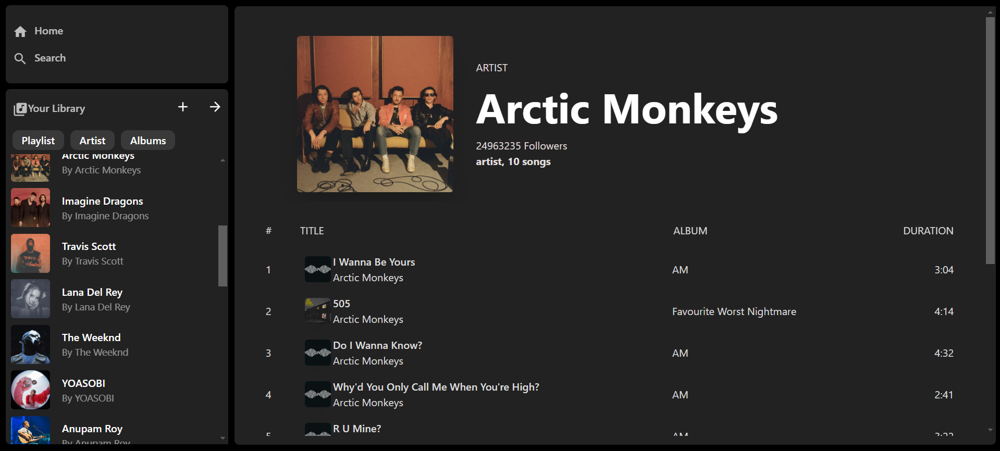
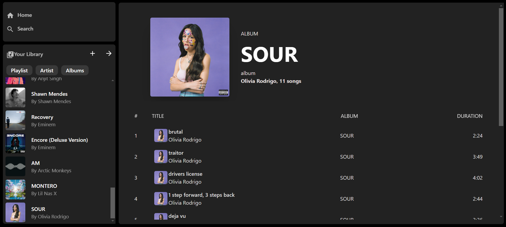
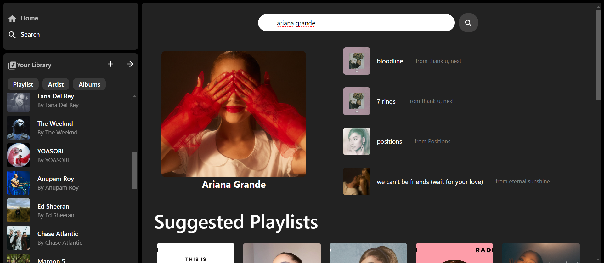
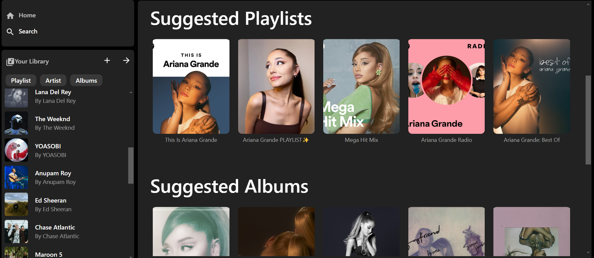
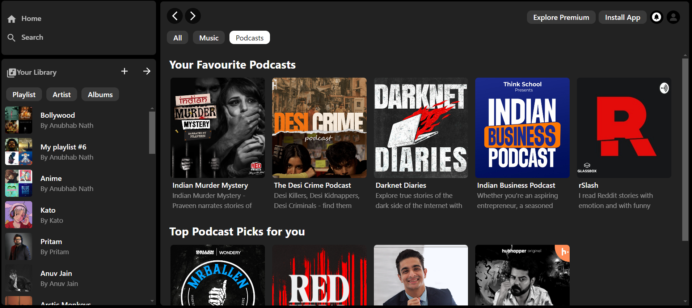

# Spotify Clone

 ## Overview
The project serves to showcase react designing and development skills. This project uses Spotify API, React js, Context API and more

# Getting Started
### Prerequisites or dependencies required to use the project

Node.js    
Any text Editor (optional)

# Installation
Follow these steps to get the project up and running:

### 1.Download Repository:
Download this repository and unzip it. Open the repository in your preferred text editor.

### 2.Install Dependencies:
Open your terminal and navigate to the project directory. Run the following command:

#### npm install

### 3.Setup Environment Variables:
Create a .env file in the root directory of the project. Add the following environment variables:

#### REACT_APP_CLIENT_ID = 'your_client_id'      
#### REACT_APP_SPOTIFY_REDIRECT_URL = http://localhost:3000

Replace 'your_client_id' with your actual Spotify Client ID obtained from your Spotify Developer account.

### 4.Start Development Server:
After setting up the .env file, start the development server by running:

#### npm start
This command will launch the development server.

# Usage
You can now make changes and use the app to your wish

# Screenshots

#### Home Page

#### Playlist Page

#### Artist Page

#### Album Page

#### Search Page
    

#### Podcast Page

